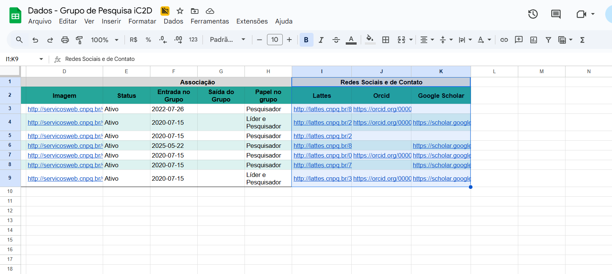
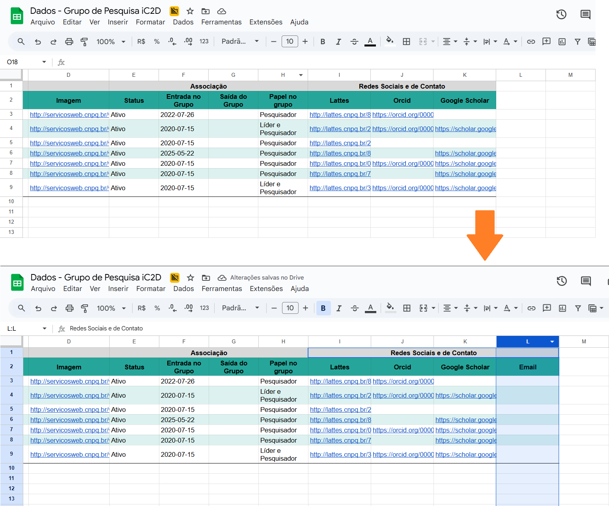

# Como adaptar o Banco de Dados?

O banco de dados do site foi construído sobre uma planilha do [Google Sheets](https://docs.google.com/spreadsheets/d/1XloJZJleV3cfxtBuNinAVojrfaJ6Olyv9i_PtyK4mC0/edit?usp=sharing), visando facilitar a manutenção pelos professores do grupo. Assim, as informações ficam centralizadas, acessíveis e podem ser visualizadas e atualizadas de forma simples, mantendo um histórico de alterações.

Com esse cenário em mente, foram desenvolvidos scripts para automatizar parcialmente a construção do site e simplificar a atualização da base de dados. Nas demais seções, é explicado como atualizar e manter o esquema atual, considerando alterações simples.

> Para alterações complexas (como adição de novas tabelas, renomeação de arquivos, interfaces etc.), é necessário adaptar a lógica geral do site.

## Sumário

- [Como atualizar a base de dados?](#como-atualizar-a-base-de-dados)
- [Como adicionar novas mídias sociais?](#como-adicionar-novas-mídias-sociais)
- [Como adicionar novos tipos de publicações?](#como-adicionar-novos-tipos-de-publicações)
- [Como alterar a estrutura de colunas das planilhas?](#como-alterar-a-estrutura-de-colunas-das-planilhas)

---

### Como atualizar a base de dados?

Para atualizar as informações na base de dados **sem alterar a estrutura de colunas das planilhas**, siga os passos abaixo:

1. Acesse a planilha do [Google Sheets](https://docs.google.com/spreadsheets/d/1XloJZJleV3cfxtBuNinAVojrfaJ6Olyv9i_PtyK4mC0/edit?usp=sharing) e, **para cada aba de informações**, baixe os dados no formato `.tsv` (_Tab-Separated Values_), atribuindo o nome respectivo a cada arquivo no banco de dados:
    - `professors.tsv` para os dados dos professores que fazem ou fizeram parte do grupo;
    - `students.tsv` para os dados dos alunos que fazem ou fizeram parte do grupo;
    - `colaborators.tsv` para os dados dos colaboradores, externos e internos;
    - `partners.tsv` para os dados das entidades parceiras;
    - `projects.tsv` para os dados dos projetos, ativos ou não, desenvolvidos pelo grupo;
    - `publications.tsv` para os dados das publicações produzidas pelos membros do grupo;
    - `awards.tsv` para os dados das premiações e méritos alcançados pelos membros do grupo.
    
    

2. Substitua os arquivos `.tsv` presentes na pasta `src/assets/db` pelos arquivos atualizados.
3. Realize o processo de deploy (ver [README](../README.md)).

Dessa forma, todas as alterações e novas inclusões de informações **dentro da estrutura de colunas existente** serão adicionadas ao site.

---

### Como adicionar novas mídias sociais?

Para adicionar referências a outras mídias sociais dos membros do grupo (professores, alunos e colaboradores), siga os passos abaixo:

1. Na planilha dos dados dos membros, localize a seção que contém os dados das mídias sociais — situada nas últimas colunas preenchidas da tabela.
    
    

2. Acrescente uma nova coluna a essa região e coloque no cabeçalho o nome da mídia social.
    > **Obs:** a ordem das colunas de mídias sociais na tabela representa a ordem dos ícones gerados na página. 

    

3. Siga o processo padrão de [atualização das informações do banco de dados](#como-atualizar-a-base-de-dados).

4. Busque ou crie o ícone representativo dessa nova mídia social em formato `.svg`.
    - Durante o desenvolvimento do projeto, foram utilizados ícones do [Freepik](http://www.freepik.com/) (com créditos no rodapé do site) ou criados usando o [Inkscape](https://inkscape.org/pt-br/).
    > **Importante**: o formato do arquivo do ícone deve ser `.svg` para garantir a responsividade e a mudança de cor ao passar o mouse sobre o ícone no site.

5. Adicione o arquivo do ícone ao diretório `src/assets/icons`, garantindo que o nome do ícone seja **exatamente o mesmo** da coluna de mídias sociais.
    > **Importante**: o nome do arquivo deve ser o mesmo da coluna adicionada no passo 2, para que a automação realize a ligação entre a coluna e o ícone.

6. Realize o processo de deploy (ver [README](../README.md)).

---

### Como adicionar novos tipos de publicações?

Para adicionar novos tipos de publicações, basta acrescentar a nova linha de dados e informar o novo tipo de publicação na coluna **"Tipo"**. Em seguida, siga o processo padrão de [atualização das informações do banco de dados](#como-atualizar-a-base-de-dados).

Contudo, é necessário adaptar a lógica presente em `src/layouts/PublicationsLayout`, nos mesmos moldes realizados para os Artigos e Anais de Congresso, para que essas publicações apareçam no site.

> Caso deseje adicionar as informações estatísticas sobre esse tipo de publicação à barra de estatísticas, é necessário realizar o processo manual descrito no guia ["Como adaptar a seção de estatísticas?"](how-to:%20statistics.md).

---

### Como alterar a estrutura de colunas das planilhas?

Caso deseje **alterar a ordem das colunas ou adicionar novas colunas**, é necessário adaptar primeiramente a lógica interna presente em `src/scripts` e, se necessário, nos componentes desenvolvidos (`src/components`). 

> **Obs:** caso sejam reordenadas ou adicionadas novas colunas **somente na seção de mídias sociais dos membros** (professores, alunos e colaboradores), não é necessário adaptação extra, conforme explicado no tópico anterior.

Caso seja realizada:
- Alteração na ordem das colunas: atualize a lógica de _parsing_ do arquivo em `src/scripts/parsers.tsv`.
- Adição de novas colunas de dados: atualize as interfaces que representam os dados da tabela modificada em `src/scripts/interfaces.tsv`, bem como a lógica de _parsing_ do arquivo em `src/scripts/parsers.tsv`.

---
