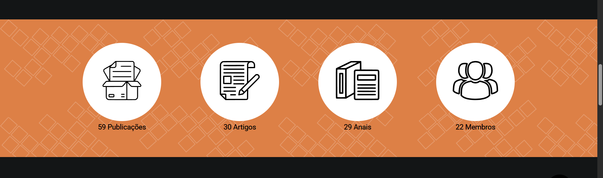

# Como adaptar a seção de estatísticas?

A seção de estatísticas consiste em uma faixa horizontal, onde é possível divulgar informações quantitativas sobre o grupo de pesquisa. Ela foi pensada para promover o grupo, mostrando de forma concreta a atuação do iC²D.



Os itens que compõem a barra de dados estatísticos seguem a interface `StatisticsItem`, definida em `src/scripts/interfaces.ts`.

```ts
interface StatisticsItem{
    /**
     * Nome do que está sendo analisado.
     * 
     * Ex: Publicações, Artigos, Membros.
     */
    name: string;

    /**
     * Quantidade de elementos existentes.
     */
    qtde: number;

    /**
     * Nome do arquivo que representa o item estatístico, localizado em `src/assets/icons`.
     */
    img_src: string;
}// StatisticsItem
```

Compreendendo a interface, para alterar os itens estatísticos apresentados, deve-se acessar `src/assets/db/index.ts`, onde é definido o _array_ utilizado para a geração dinâmica dos itens na página.

```ts
...
const statistics_itens: StatisticsItem[] = [
    { 
        name: "Publicações", 
        qtde: publications.length, 
        img_src: "Publicacoes" 
    },
    { 
        name: "Artigos", 
        qtde: publications.filter(pub => pub.type == "Artigo").length, 
        img_src: "Artigos" 
    },
    ...
    ,
    { 
        name: "Membros", 
        qtde: professors.filter(prof => prof.membership.status == "Ativo").length + 
                students.filter(student => student.membership.status == "Ativo").length, 
        img_src: "Membros" 
    },
    ...
]
...
```

Como pode ser visto no trecho extraído de `src/assets/db/index.ts`, os itens são definidos como um _array_, `statistics_itens`. Assim, para:

- Remover um item, basta comentar ou remover a entrada correspondente no _array_ `statistics_itens`.
- Adicionar um item, deve-se:
    1. Adicionar um novo objeto ao `statistics_itens`, contendo as informações conforme a interface `StatisticsItem`.
    2. Adicionar o arquivo do ícone associado a esse item, para que ele seja apresentado na página como os demais.

> **Importante**: a lógica desenvolvida espera que os ícones sejam arquivos `.svg`. Recomenda-se vetorizá-los usando uma ferramenta apropriada (por exemplo, [Inkscape](https://inkscape.org/pt-br/)), caso não estejam no formato adequado.

Após realizar as alterações desejadas, basta realizar o processo de deploy (ver [README](../README.md)).